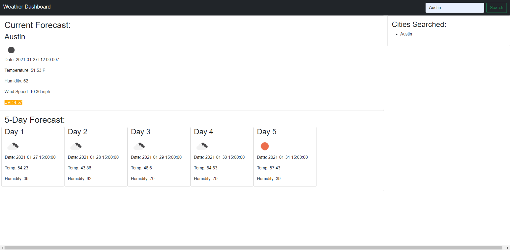

# Weather-Dashboard

This weather dashboard was created for the user to be able to put in a city into the search area and find out the current weather for said city. It will give the user the temperature, humidity, windspeed, and will let the user know the UVI conditions via color coding. The user will also see the forecast for the next 5 days as well. 

[Check out the Weather Dashboard here](https://danacorona.github.io/Weather-Dashboard/)

# Screenshots
